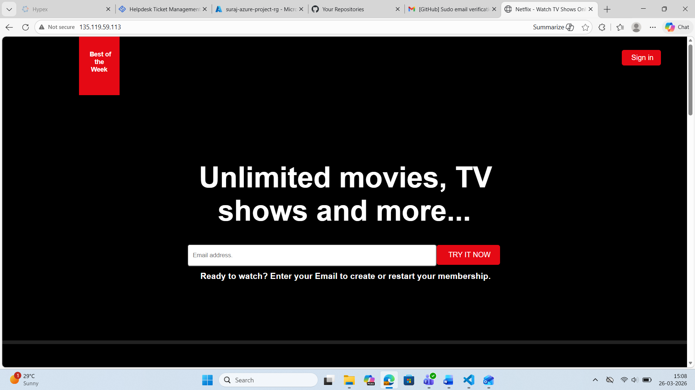
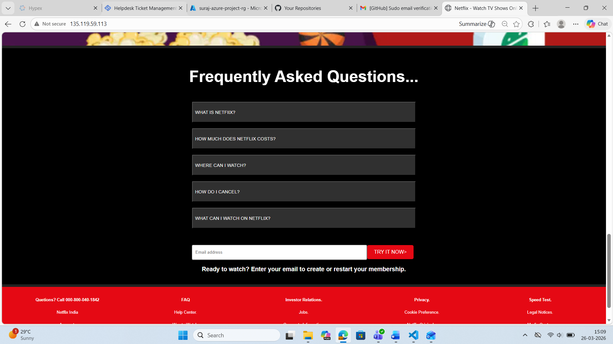
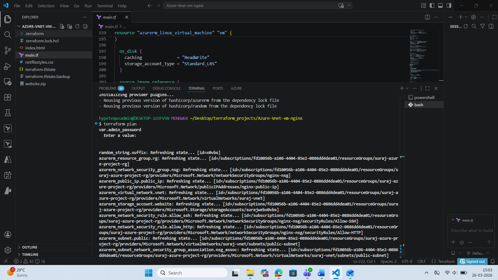
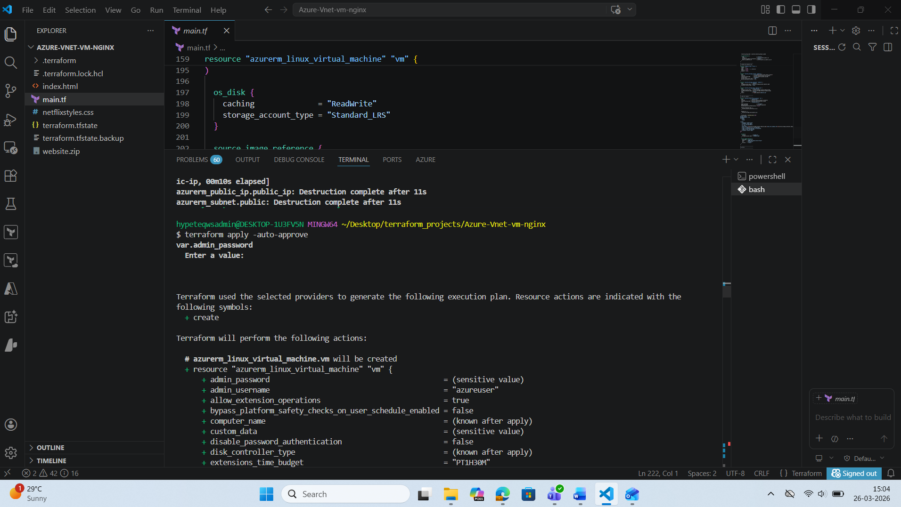
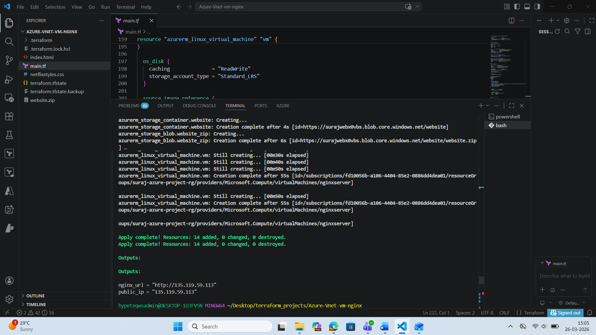
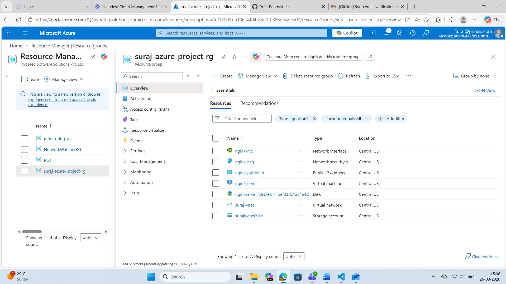
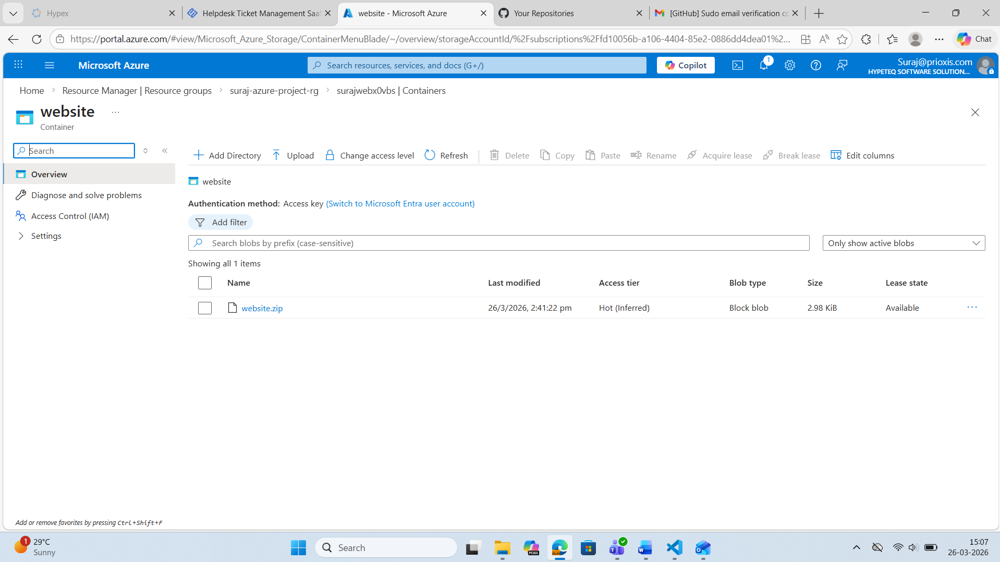

# Azure VNet + Nginx Website using Terraform

This project deploys an **Nginx web server** on an **Azure Linux VM** using **Terraform**.
The website files are stored in **Azure Blob Storage** and automatically deployed on VM startup.

---

## 🚀 Technologies Used
- Terraform
- Microsoft Azure
- Azure Virtual Network
- Azure VM (Ubuntu)
- Nginx
- Azure Blob Storage

---

## 🏗️ Architecture
- Resource Group
- Virtual Network + Subnet
- Network Security Group (SSH + HTTP)
- Public IP
- Linux VM
- Blob Storage (website.zip)

---

## 🖥️ Website Output

# 
images/Output-1.png

# 
images/Output-2.png

---

## ⚙️ Terraform Execution

### Initialize Terraform
terraform init

# 
images/terraform-init-validate.png

Plan Infrastructure
terraform plan

# 
images/terraform-plan.png

Apply Infrastructure
terraform apply

# 
images/terraform-apply.png

Terraform Apply Output

# 
images/url.png

 ☁️ Azure Resources
 
# 
images/resource-group.png

# 
images/azure-website.zip-uploaded.png

 🌐 Access Website
 After apply, open:
http://20.12.221.162

 👤 Author
Suraj Chandel
